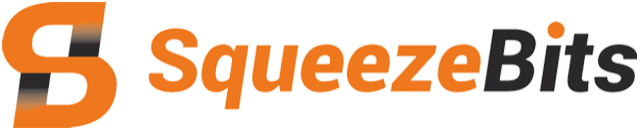
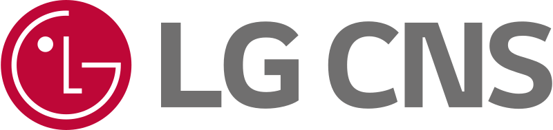

# Eunik Park | ML Engineer

## About Me
---

I am a 3-year experienced ML Engineer specializing in making AI models lightweight, fast, and efficient. My primary focus is on Efficient AI, particularly Quantization. I optimize various models (Vision, Audio, LLM) for mobile, GPU, and NPU platforms.

## Skills
---

 

 

## Work Experience
---

### ML Engineer @ SqueezeBits 

*06/2022 - Present*

- Optimizing models for target hardware & platforms
- Enhancing performance-speed trade-offs through PTQ and QAT
- Conducted benchmarking of vLLM and TensorRT-LLM serving

### Internship @ LG CNS 
*07/2021 - 08/2021*

- Built AWS 3-tier web service using Terraform

## Projects
---

###  OwLite
*08/2023 - Present*

**[[Website](https://owlite.ai)]**
**[[Github](https://github.com/squeezebits/owlite)]**
**[[OwLite Examples](https://github.com/SqueezeBits/owlite-examples)]**

- Developed a framework for easy model quantization from PyTorch to TensorRT
- Implemented various quantization algorithms and simulations
- Produced various examples and identified optimization patterns

###  Fits-on-Chips
*02/2024 - 06/2024*

**[[Website](https://fits-on-chips.com)]**

- Conducted comprehensive performance benchmarking of LLM serving frameworks
- Implemented evaluation module
- Wrote blog post, **[[vLLM vs TensorRTLLM] weight-activation quantization](https://blog.squeezebits.com/vllm-vs-tensorrtllm-7-weightactivation-quantization-34461)**

### Efficient Keyword Spotting Research
*02/2024 - 06/2024*

- Presented poster at Interspeech 2024  
  [RepTor: Re-parameterizable Temporal Convolution for Keyword Spotting via Differentiable Kernel Search](https://www.isca-archive.org/interspeech_2024/park24_interspeech.html)
- Developed CNN-based KWS model using structural reparameterization
- Implemented Latency-aware Neural Architecture Search
- Achieved 97.9% accuracy with 183μs latency on Galaxy S10 CPU

## Education
---
### POSTECH
- Bachelor's in IT Convergence Engineering
- 03/2016 - 09/2023

### Changwon Science High School
- 03/2014 - 02/2016
